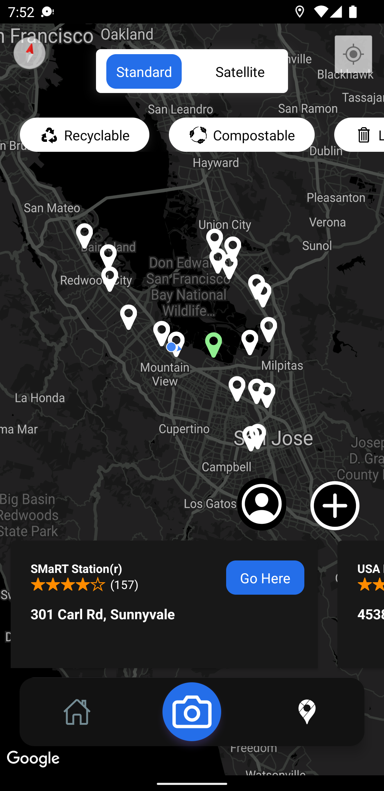

# RecycleMe

    
    

RecycleMe is a trash categorization tool used to make recycling more quick and convenient. The user can take a picture of a certain item and our ML will determine its recyclability and where to recycle it. Our map takes in a collection of data from the Google Maps API and user-generated data by both our standard users and by businesses.

    
    

## 💻 What it does
RecycleMe allows users to locate the nearest trash cans through 3 types of data:
- the nearest recycling centers via the google maps api
- user-generated data of trash cans nearby and what materials it recycles
- local businesses which provides more specific types of data that they specifically could recycle

# SETUP

Clone this repo and then:

1. Install the necessary dependencies

    * `npm install --global yarn` 
    * `yarn install`

2. Install the expo cli

    * `yarn install --global expo-cli`

3. Install the expo go app either on google play or the app store

4. Register or sign into an account from both your phone and your computer. 
    * `expo login` or `expo register`

5. Fill in all API keys in environment.js file (currently this repository is private, so we kept the keys inside it to ease your testing)

    * `npm run start`

You should see the app in your expo app under the **RECENTLY IN DEVELOPMENT** section

## 📧 Contact Us
Contact us at nextchart.beachrock@gmail.com for anything!

Happy Coding!